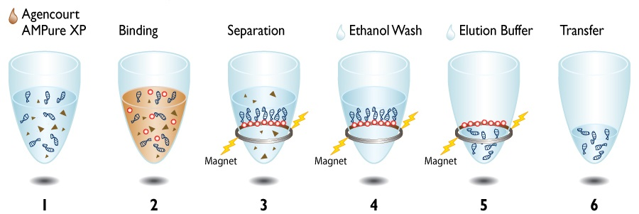

## Blunt Ends

#### Materials

NEB Quick Blunting Kit (NEB #E1201L)  
Thermomixer Comfort (Eppendorf # )  
Ampure XP beads (Beckman Coulter #A63880)  
80% Ethanol    

#### Protocol

Reagent             | 1 x Reaction | 7 x Reaction
--------------------|--------------|--------------
10x Blunting Buffer | 5.0 $\mu$l   | 35.0 $\mu$l
dNTPs (1mM)         | 5.0 $\mu$l   | 35.2 $\mu$l
Blunting Enzyme     | 2.0 $\mu$l   | 14.0 $\mu$l
Total               | 12.0 $\mu$l  | 84.0 $\mu$l  

- Add 12uL of Blunting MM to ~38uL of RAD library.
- Incubate for 30 min at 30°C (In the PCR machine for example)
- Purify each reaction with Ampure XP beads using a ratio of 0.8V Ampure Beads: 1V DNA e.g 40uL Ampure Beads: 50uL Blunting Reaction.

**Ampure beads**
We are using a slightly different protocol. The original can be found [here](https://www.beckmancoulter.com/wsrportal/techdocs?docname=B37419AA).

  
Ampure beads workflow:   

1. Put the samples in a 96-wells U-shaped microplate (the one that's fits on the Ampure beads magnet plate), check that the microplate is new, covered and wells are clean.
2. Purify each reaction with Ampure XP beads using a ratio of 0.8V Ampure Beads: 1V DNA e.g 40uL Ampure Beads: 50uL A-Tailing Reaction. (be sure to mix with the pipette 20 times, that´s the replacement for vortexing in original protocol) **Incubate at RT for 5?? min**
3. Put the microplate with the samples + beads on the magnet and leave for 3-5min until beads form a pellet on the side of the tube and then remove supernatant. Be careful to not remove the beads (checking pipette tip is helpful), its ok to leave some rest in (especially if beads are moving).
4. Wash beads: Add 200 $\mu$l of 80% Ethanol to the beads. Wait for 1-2min until beads form a pellet on side of tube again. Remove supernatant.  This time it should be easy to remove everything. Repeat wash.
5. **Elute library:** Leave beads to dry for ~5min. Be careful not to over-dry beads.  Beads should look matt, not shiny, but the bead pellets should not have cracks running through them. **Remove from magnet after drying.**
Add 42 $\mu$l of EB (RB) to beads and vortex to re-suspend. Incubate off the magnet for 1 min and then incubate on the magnet for 1-2min until beads form a pellet on side of tube.  
6. Remove 42 $\mu$l of eluate to a new, labelled tube.
