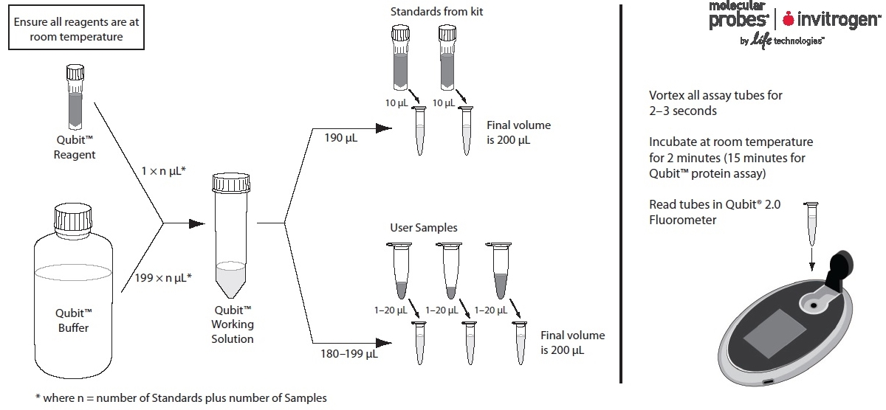

## 1. Pre-library sample QC

### 1.1. gel electrophoresis to check DNA integrity

Notes: Check for presence of high molecular weight DNA, DNA degradation, 
presence of RNA, blobs of nucleic acid that suggest sample has not dissolved.

#### Protocol for Kanchons Lab (0.7 % gel, 70 ml total)

1. Add agarose (0.07 * 70 = 4.9g) to 70ml TBE Buffer
2. Heat up in the microwave for  ~2 minutes until agarose has diluted completely
3. Let it cool down a bit
4. In the meantime prepare tray with tape
5. Add 7$\mu$l (5 $\mu$l for 50ml total) SYBR Safe DNA gel stain
6. Put gel into the tray, add combs
7. wait 30 min for the gel to dry

8. Prepare samples: 1 $\mu$l in some dye
9. 1 $\mu$l of the ladder
10. Put gel tray into electrophoresis machine, fill with buffer.
11. DNA runs to the + pole (red)
12. 70 V for 30 min
13. Have a first look with the bright light, then take photo in the chamber one 
one floor down

### 1.2. Qubit flourometer for quantification of DNA

General:  

* Why Qubit instead of Nanoview : (to be added)  

* For best results, store the dye and the buffer at room
temperature. Store the DNA, RNA, and protein standards at 4°C.
Ensure that all assay reagents are at room temperature before you
begin.

* Link to the original [protocol](http://www.ebc.uu.se/digitalAssets/176/176882_3qubitquickrefcard.pdf)

* Two different Assays: BR for broad range (> 50 ng/ $\mu$l ), HS for High sensitivity (< 50 ng/ $\mu$l)  

Mastermix preparation:  
  

#### Qubit protocol: 

1. Prepare Mastermix
   + 199 $\mu$l buffer + 1 $\mu$l reagent  for each sample and the two standards (plus 5% extra)
   + eg. for 16 samples the Mastermix contains 3791.1 $\mu$l + 18.9 $\mu$l = 3810 $\mu$l
     + 199 $\mu$l * (16 + 2 + 0.05 * 18) = 3761.1 Buffer  
     + 1 $\mu$l * (16 + 2 + 0.05 * 18) = 18.9   Reagent
     
2. When taking 2 $\mu$l DNA for measurement (its possible to take a different amount):
  + 198 $\mu$l mastermix + 2 $\mu$l DNA for every sample
  + 190 $\mu$l mastermix + 10 $\mu$l size standard 1
  + 190 $\mu$l mastermix + 10 $\mu$l size standard 2

3.	Shortly vortex each sample and the standards
4.  Let samples incubate at RT for 2 minutes
5.	Qubit adjustment with standards (Reference is sensitive to temperature change, so better adjust every time)
6.	Measure samples
7.	Measure standards themselves to control (S1 should be ~ 0, S2 should be ~ 5)

